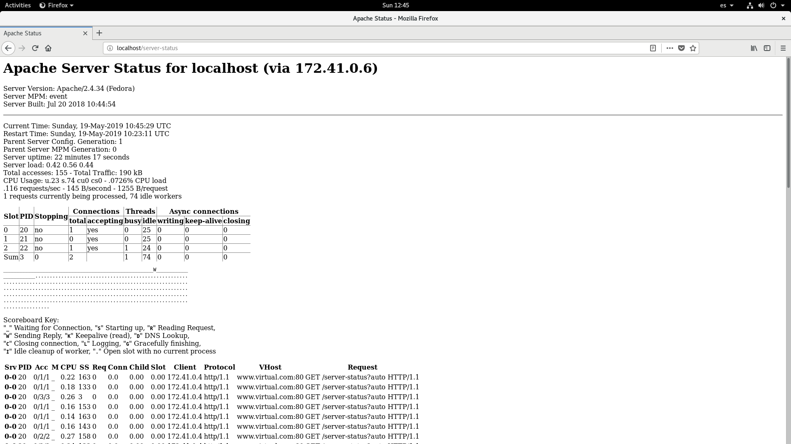
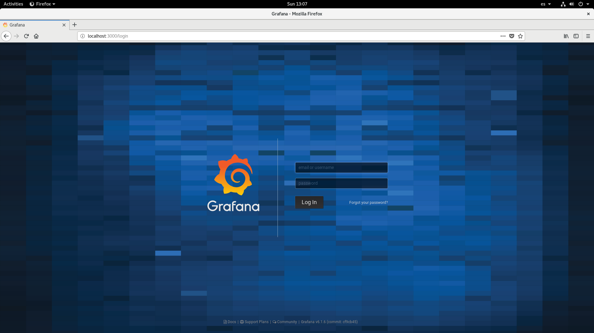
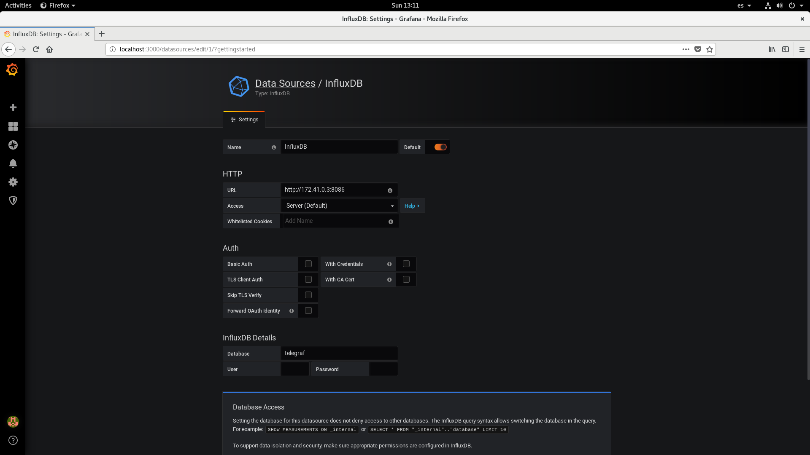
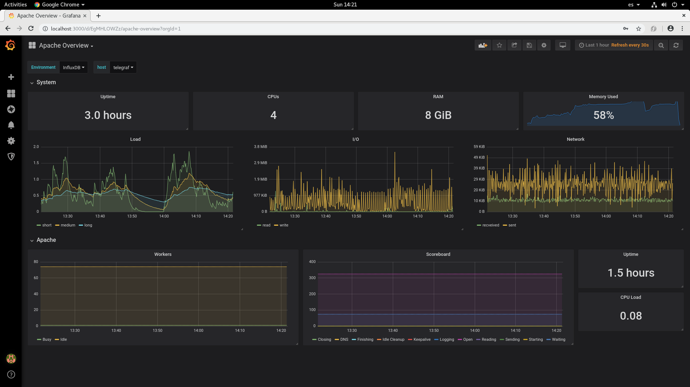

# Documentación del Proyecto

El proyecto consiste en general en la monitorización de la infraestructura 
como por ejemplo de una empresa o entidad y lo empleare con Grafana.

En esta caso voy a explicar como montar dicha estructura con la ayuda
de **Influxdb** y **Telegraf** que forman un duo perfecto para el tratamiento de los
datos para su posterior visualización con Grafana

## Información general

* [Telegraf](https://github.com/isx27423760/projecte-franlin/blob/master/Documentation/telegraf.md): Se encarga de recolectar todos los datos que le pasamos mediante el 
            fichero de configuración **telegraf.conf**, para posteriormente informar 
            de todas las métricas recolectadas. 

* [InfluxDB](https://github.com/isx27423760/projecte-franlin/blob/master/Documentation/influxDB.md): Es el lugar donde Telegraf envía toda esta información, ya que 
			InfluxDB esta especialmente diseñado para almacenar de manera eficiente 
			una cantidad importante de información


* [Grafana](https://github.com/isx27423760/projecte-franlin/blob/master/Documentation/grafana.md): Es el Dashboard que se encargara de mostrar toda la información que InfluxDB tiene 
           almacenado en las Bases de Datos en forma de gráficas que se podran configurar 
           facilmente.

## Instalación 

### Características del sistema

La instalacón se efectuara en un Fedora 27, con las siguientes caracteristicas:

```
    RAM: 16 GB
    HDD: 225 GB
    Swap: 5 GB
    System type: 64 bits
    Processor: Intel Core (TM) i7-6700 CPU @ 3.40GHz
```

### Características de los servicios

- Grafana: Versión 6.1.6 
- Telegraf: Versión 1.10.4
- InfluxDB: Versión 1.7.6

Para la instalación y puesta en marcha de los servicios ver estas documentaciónes:

1. How to install [Telegraf](https://github.com/isx27423760/projecte-franlin/blob/master/Documentation/HowToInstallTelegraf.md)
2. How to install [InfluxDB](https://github.com/isx27423760/projecte-franlin/blob/master/Documentation/HowToInstallInfluxDB.md)
3. How to install [Grafana](https://github.com/isx27423760/projecte-franlin/blob/master/Documentation/HowToInstallGrafana.md)

### Esquema de la infraestructura a montar con Dockers:


### Puesta en marcha 

Primero tenemos que crear un fichero docker-compose.yml en el que estara 
los servicios necesarios para el funcionamiento.

```
version: "3"
services:
  #Servidor Grafana
  grafana:
    build:
      context: $PWD/dockerGrafana/
      dockerfile: Dockerfile
    container_name: grafana.server
    hostname: grafana.server
    ports:
      - "3000:3000"
    networks:
      _net:
       ipv4_address: 172.41.0.2
  #Servidor InfluxDB
  influxdb:
    build:      
      context: $PWD/dockerInfluxDB/
      dockerfile: Dockerfile
    container_name: influxdb.server
    hostname: influxdb.server
    ports: 
      - "8086:8086"
      - "8088:8088"
    networks:
      _net:
       ipv4_address: 172.41.0.3
  #Telegraf
  telegraf:
   image: telegraf
   container_name: telegraf
   hostname: telegraf
   restart: always
   extra_hosts:
     - "influxdb:172.41.0.3"
     - "openldap:172.41.0.5"
     - "www.virtual.com:172.41.0.6"
   environment:
     HOST_PROC: /rootfs/proc
     HOST_SYS: /rootfs/sys
     HOST_ETC: /rootfs/etc
   volumes:
    - ./telegraf.conf:/etc/telegraf/telegraf.conf:ro
    - /var/run/docker.sock:/var/run/docker.sock:ro
    - /sys:/rootfs/sys:ro
    - /proc:/rootfs/proc:ro
    - /etc:/rootfs/etc:ro
   networks:
     _net:
       ipv4_address: 172.41.0.4
  #Servidor OpenLDAP
  ldap:
   build:      
      context: $PWD/LDAPmonitoring/
      dockerfile: Dockerfile
   container_name: ldap.server
   hostname: ldap.server
   ports: 
     - "389:389"
   networks:
     _net:
       ipv4_address: 172.41.0.5
  #Servidor HTTP
  httpd:
   build:
      context: $PWD/HTTPmonitoring/
      dockerfile: Dockerfile
   container_name: www.myserver.org
   hostname: www.myserver.org
   ports: 
     - "80:80"
   networks:
     _net:
       ipv4_address: 172.41.0.6
   
networks:
  _net:
   driver: bridge
   ipam:
    config:
      - subnet: 172.41.0.0/16
```

Despues ponemos en marcha los servidores:

```
[isx27423760@localhost projecte-franlin]$ docker-compose up -d
Creating network "projectefranlin__net" with driver "bridge"
Creating influxdb.server  ... done
Creating www.myserver.org ... done
Creating grafana.server   ... done
Creating telegraf         ... done
Creating ldap.server      ... done
```

Una vez puesto en marcha los servidores comprobamos que los puertos de http(80),
ldap(389),influxdb(8086 y 8088) y grafana(3000) estan mapeados localmente en nuestro ordenador.

```
[isx27423760@localhost projecte-franlin]$nmap localhost
Nmap scan report for localhost (127.0.0.1)
Host is up (0.00012s latency).
Other addresses for localhost (not scanned): ::1
Not shown: 992 closed ports
PORT     STATE SERVICE
80/tcp   open  http
389/tcp  open  ldap
3000/tcp open  ppp
8086/tcp open  d-s-n
8088/tcp open  radan-http
``` 
#### Comprobación del funcionamiento de LDAP y HTTP

* Para comprovar que el servidor LDAP esta fucionando , ejecutamos la siguiente orden:
	```
	[isx27423760@localhost LDAPmonitoring]$ ldapsearch -x -h localhost -b 'cn=Monitor' -s base 1.1
	# extended LDIF
	#
	# LDAPv3
	# base <cn=Monitor> with scope baseObject
	# filter: (objectclass=*)
	# requesting: 1.1 
	#
	
	# Monitor
	dn: cn=Monitor
	
	# search result
	search: 2
	result: 0 Success
	
	# numResponses: 2
	# numEntries: 1
	```
*	Para comprovar el servidor HTTP esta funcionando , ejecutamos la siguinete orden:
	```
	[king@localhost LDAPmonitoring]$ telnet localhost 80
	Trying ::1...
	Connected to localhost.
	Escape character is '^]'.
	GET / HTTP/1.0
	
	HTTP/1.1 200 OK
	Date: Sun, 19 May 2019 10:44:26 GMT
	Server: Apache/2.4.34 (Fedora)
	Last-Modified: Sun, 19 May 2019 10:22:58 GMT
	ETag: "84-5893afff1cfa4"
	Accept-Ranges: bytes
	Content-Length: 132
	Connection: close
	Content-Type: text/html; charset=UTF-8
	
	<html>
	<title>www.virtual.com</title>
	<body>
	<h1> Page of server</h1>
	Test de que funciona OK . www.virtual.com
	</body>
	</html>
	Connection closed by foreign host.
	```
	
	Tambien podem comprovar el estado del servidor HTTP en el navegador:
	
	

#### Comprovación de Telegraf

En la configuración de telegraf puse que las métricas recibidas lo guarde en 
fichero con la extención JSON :

```
$ cat /etc/telegraf/telegraf.conf
[[outputs.file]]
  ## Files to write to, "stdout" is a specially handled file.
  files = ["stdout", "/tmp/metrics.js"]

  ## Data format to output.
  ## Each data format has its own unique set of configuration options, read
  ## more about them here:
  ## https://github.com/influxdata/telegraf/blob/master/docs/DATA_FORMATS_OUTPUT.md
  data_format = "json"

  ## The resolution to use for the metric timestamp.  Must be a duration string
  ## such as "1ns", "1us", "1ms", "10ms", "1s".  Durations are truncated to
  ## the power of 10 less than the specified units.
  json_timestamp_units = "1s"
```

vemos el fichero en texto plano entrando en contenedor Docker:

```
$ docker exec -it telegraf /bin/bash
root@telegraf:~# more /tmp/metrics.js 
{"fields":{"connections_current":1,"connections_max_file_descriptors":1048576,"connections_total":1001,"databases_database_1":0,"operations_abandon_completed":0,"operations_abandon_initiated":0,"operations_add_c
ompleted":0,"operations_add_initiated":0,"operations_bind_completed":0,"operations_bind_initiated":0,"operations_compare_completed":0,"operations_compare_initiated":0,"operations_delete_completed":0,"operations_
delete_initiated":0,"operations_extended_completed":0,"operations_extended_initiated":0,"operations_modify_completed":0,"operations_modify_initiated":0,"operations_modrdn_completed":0,"operations_modrdn_initiate
d":0,"operations_search_completed":0,"operations_search_initiated":1,"operations_unbind_completed":0,"operations_unbind_initiated":0,"statistics_bytes":2320,"statistics_entries":28,"statistics_pdu":27,"statistic
s_referrals":0,"threads_active":1,"threads_backload":1,"threads_max":16,"threads_max_pending":0,"threads_open":1,"threads_pending":0,"threads_starting":0,"time_uptime":9,"waiters_read":1,"waiters_write":0},"name
":"openldap","tags":{"host":"telegraf","port":"389","server":"openldap"},"timestamp":1558261410}
{"fields":{"tcp_close":0,"tcp_close_wait":0,"tcp_closing":0,"tcp_established":3,"tcp_fin_wait1":0,"tcp_fin_wait2":0,"tcp_last_ack":0,"tcp_listen":1,"tcp_none":0,"tcp_syn_recv":0,"tcp_syn_sent":0,"tcp_time_wait":
0,"udp_socket":1},"name":"netstat","tags":{"host":"telegraf"},"timestamp":1558261410}
{"fields":{"BusyWorkers":1,"BytesPerSec":0,"CPUChildrenSystem":0,"CPUChildrenUser":0,"CPUSystem":0,"CPUUser":0,"ConnsAsyncClosing":0,"ConnsAsyncKeepAlive":0,"ConnsAsyncWriting":0,"ConnsTotal":0,"IdleWorkers":74,
"Load1":2.92,"Load15":0.41,"Load5":0.85,"ParentServerConfigGeneration":1,"ParentServerMPMGeneration":0,"ReqPerSec":0,"ServerUptimeSeconds":18,"TotalAccesses":0,"TotalkBytes":0,"Uptime":18,"scboard_closing":0,"sc
board_dnslookup":0,"scboard_finishing":0,"scboard_idle_cleanup":0,"scboard_keepalive":0,"scboard_logging":0,"scboard_open":325,"scboard_reading":0,"scboard_sending":1,"scboard_starting":0,"scboard_waiting":74},"
name":"apache","tags":{"host":"telegraf","port":"80","server":"www.virtual.com"},"timestamp":1558261410}
{"fields":{"icmp_inaddrmaskreps":0,"icmp_inaddrmasks":0,"icmp_incsumerrors":0,"icmp_indestunreachs":0,"icmp_inechoreps":0,"icmp_inechos":0,"icmp_inerrors":0,"icmp_inmsgs":0,"icmp_inparmprobs":0,"icmp_inredirects
":0,"icmp_insrcquenchs":0,"icmp_intimeexcds":0,"icmp_intimestampreps":0,"icmp_intimestamps":0,"icmp_outaddrmaskreps":0,"icmp_outaddrmasks":0,"icmp_outdestunreachs":0,"icmp_outechoreps":0,"icmp_outechos":0,"icmp_
outerrors":0,"icmp_outmsgs":0,"icmp_outparmprobs":0,"icmp_outredirects":0,"icmp_outsrcquenchs":0,"icmp_outtimeexcds":0,"icmp_outtimestampreps":0,"icmp_outtimestamps":0,"ip_defaultttl":64,"ip_forwarding":1,"ip_fo
rwdatagrams":0,"ip_fragcreates":0,"ip_fragfails":0,"ip_fragoks":0,"ip_inaddrerrors":0,"ip_indelivers":4,"ip_indiscards":0,"ip_inhdrerrors":0,"ip_inreceives":24,"ip_inunknownprotos":0,"ip_outdiscards":0,"ip_outno
routes":0,"ip_outrequests":5,"ip_reasmfails":0,"ip_reasmoks":0,"ip_reasmreqds":0,"ip_reasmtimeout":0,"tcp_activeopens":1,"tcp_attemptfails":0,"tcp_currestab":1,"tcp_estabresets":0,"tcp_incsumerrors":0,"tcp_inerr
s":0,"tcp_insegs":4,"tcp_maxconn":-1,"tcp_outrsts":0,"tcp_outsegs":5,"tcp_passiveopens":0,"tcp_retranssegs":0,"tcp_rtoalgorithm":1,"tcp_rtomax":120000,"tcp_rtomin":200,"udp_ignoredmulti":0,"udp_incsumerrors":0,"
udp_indatagrams":0,"udp_inerrors":0,"udp_noports":0,"udp_outdatagrams":0,"udp_rcvbuferrors":0,"udp_sndbuferrors":0,"udplite_ignoredmulti":0,"udplite_incsumerrors":0,"udplite_indatagrams":0,"udplite_inerrors":0,"
udplite_noports":0,"udplite_outdatagrams":0,"udplite_rcvbuferrors":0,"udplite_sndbuferrors":0},"name":"net","tags":{"host":"telegraf","interface":"all"},"timestamp":1558261410}
{"fields":{"bytes_recv":11411,"bytes_sent":1234,"drop_in":0,"drop_out":0,"err_in":0,"err_out":0,"packets_recv":95,"packets_sent":14},"name":"net","tags":{"host":"telegraf","interface":"eth0"},"timestamp":1558261
410}
{"fields":{"aio-max-nr":1048576,"aio-nr":2661,"dentry-age-limit":45,"dentry-nr":115319,"dentry-unused-nr":93554,"dentry-want-pages":0,"file-max":809950,"file-nr":16416,"inode-free-nr":633,"inode-nr":98373,"inode
-preshrink-nr":0},"name":"linux_sysctl_fs","tags":{"host":"telegraf"},"timestamp":1558261410}
{"fields":{"blocked":2,"dead":0,"idle":66,"paging":0,"running":0,"sleeping":237,"stopped":0,"total":305,"total_threads":1250,"unknown":0,"zombies":0},"name":"processes","tags":{"host":"telegraf"},"timestamp":155
8261410}
............MORE LINES...................................................
```

#### Comprovación de InfluxDB

Entramos en el contenedor docker del servidor InfluxDB:

```
$ docker exec -it influxdb.server /bin/bash
```

Entramos en la base de datos, con la siguiente orden:

```
[root@influxdb docker]# influx
Connected to http://localhost:8086 version 1.7.6
InfluxDB shell version: 1.7.6
Enter an InfluxQL query
> 
```

Entramos a la base de datos de Telegraf y vemos las 
medidas que le esta pasando, y vemos que estan apache,openldap,cpu,ram,disk,etc:

```
> show databases
name: databases
name
----
telegraf
_internal
> use telegraf
Using database telegraf
> show measurements
name: measurements
name
----
apache
cpu
disk
diskio
interrupts
kernel
linux_sysctl_fs
mem
net
netstat
openldap
processes
soft_interrupts
swap
system
```

#### Comprovación de Grafana

En el navegador nos conectamos a htttp://localhost:3000:



Una vez dentro, inciciamos sesioón con las credenciales por defecte
que nos facilita grafana user:admin y password:admin y hacemos los siguientes pasos:

- Implementamos nuestra base de datos InfluxDB en Grafana:

	

- Despues de agregar nuestra base de datos podemos crear los dashboards o paneles 
que queramos

	


