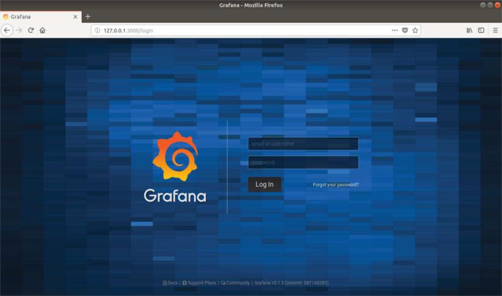
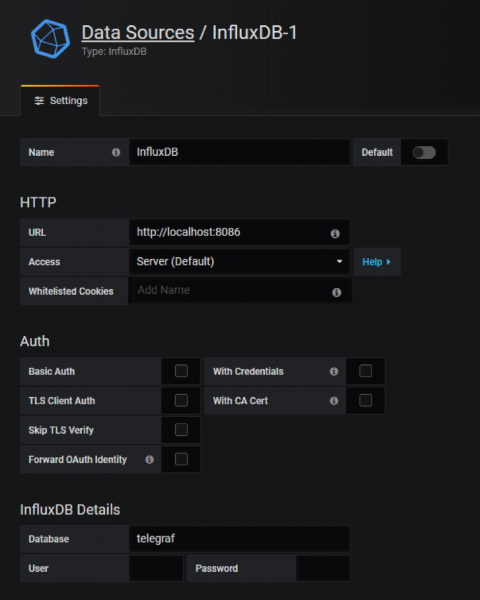
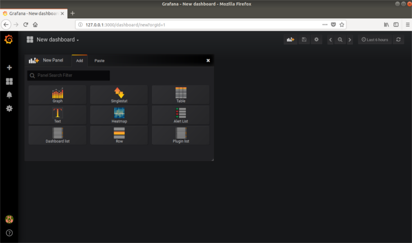
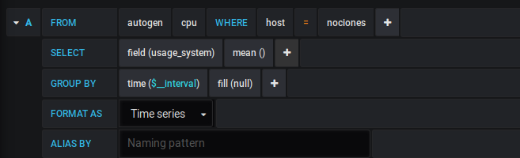
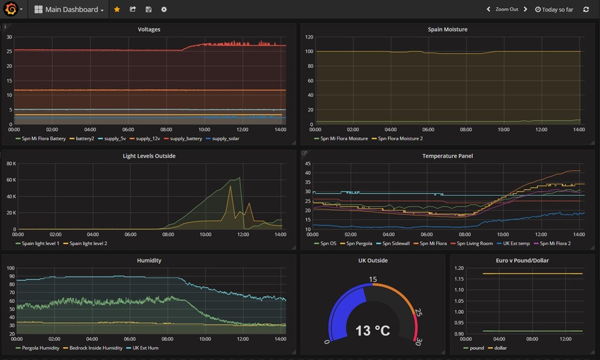

# Grafana

Grafana es una herramienta para visualizar datos de serie temporales. 
A partir de una serie de datos recolectados obtendremos un panorama gráfico de 
la situación de una empresa u organización.

Un dato es una representación simbólica (numérica, alfabética, algorítmica, espacial, etc.) 
de un atributo o variable cuantitativa o cualitativa. Los datos describen hechos, sucesos y entidades.
Una serie temporal o cronológica es una secuencia de datos, observaciones o 
valores, medidos en determinados momentos y ordenados cronológicamente. 

En resumen, es apenas una vía o manera de representar datos estadísticos de una manera rápida 
y pública, utilizando siempre código abierto y/o software libre.

## Características de Grafana

* Dispone de paneles dinámicos y reutilizables.
* Permite la autenticación vía LDAP, Google Auth, Grafana.com y Github. 
* Gráficos elegantes para la visualización de datos.
* Interfaz rápido y flexible con numerosas opciones.

## Instalación de grafana en Fedora

En este [HowToInstallGrafana](https://github.com/isx27423760/projecte-franlin/blob/master/Documentation/HowToInstallGrafana.md) explico como instalar grafana en Fedora 27.

### Archivos Importantes

- Ficheros binarios en **/usr/sbin/grafana-server**
- Script de inicio está ubicado en **/etc/init.d/grafana-server**
- Fichero por defecto en **/etc/sysconfig/grafana-server**
- Fichero de configuración está en **/etc/grafana/grafana.ini**
- El fichero de logs/registros está en /var/log/grafana.log
- La base de datos en grafana está en **/var/lib/grafana/grafana.db.**

### Introducción a  Grafana

Una vez arrancado ya el servidor, abrimos el navegador y escribimos:
**http://direccion-IP:3000** ,grafana escucha por el perto 3000, para acceder a la 
interficie web. Utilizare las credenciales de nombre de usuario: admin y contraseña: admin.

Llegados a este punto, tendremos que agregar una base de datos o una fuente de datos. 
Haremos clic en ‘Add data source‘.
Por ejemplo, agregaremos una base de datos InfluxDB. Especificaremos el nombre de la fuente de datos, 
el tipo y los parámetros de conexión. Después haremos clic en Save and Test.

Desde el panel de Inicio, haremos clic en New Panel para agregar uno nuevo. 
Con el podremos visualizar las métricas de nuestra fuente de datos.

Después aparecerá en su titulo "Panel Title", podremos acceder a la opción de editar,
que es donde grafana muestra su verdadera potencia. Hacemos una consulta de la cpu por ejemplo.
Los campos nos darán la posibilidad de hacer distintas consultas con tan solo pulsar sobre ellos.

Y podemos hacer infinidad de consultas y para diferentes medidas que tenga disponible nuestra
base de datos InfluxDB y posteriormente grafana nos lo mostraría de la siguiente manera.

